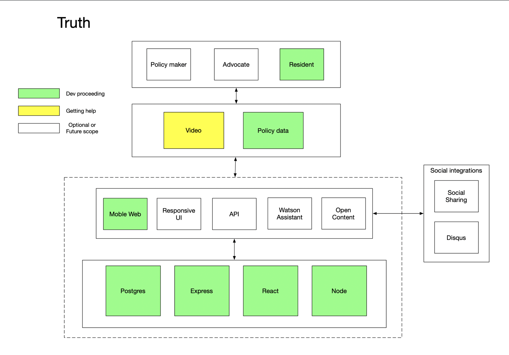

# Team Truth

## Contents

1. [Short description](#short-description)
1. [The architecture](#the-architecture)
1. [Getting started](#getting-started)
1. [Contributing](#contributing)

## Short description

### What's the problem?

Concerned and impacted citizens don't have a straightforward way of knowing what or how policies and regulations impact them or what they can do in response.

### How can technology help?

Our application will allow users to:
* Explore current and proposed policies in a bite sized format
* See how these policies affect or will affect areas of concern to the user
* Share their stories and experiences with fellow residents and policy makers
* Aggregate sentiment on policy
* Find more opportunities for dialogue between residents and policy makers

## The architecture

## Getting started

Instructions to get you a copy of the project up and running on your local machine for development and testing purposes can be found [here.](docs/README.md)

## Contributing

Please read [CONTRIBUTING.md](CONTRIBUTING.md) for details on our code of conduct, and the process for submitting pull requests to us.
