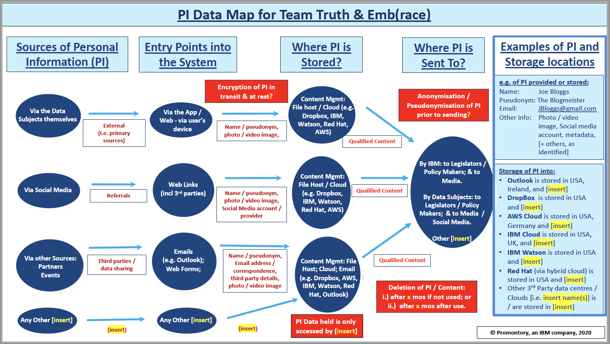

[hi-level-arch]: images/architectural-diagram.png "High Level Architecture"
[components]: images/components.jpg "Components"
[PRL-data]: images/PRL-data.jpg "Policy, Regulation & Legislation Data"
[openshift]: images/openshift.png "OpenShift Console"
[erd]: images/team-truth-erd-20200923T1642Z.png "Database ERD"

# Team Truth
## Truth in Legislation

### Team Members

#### Developers:
Peter Ihlenfeldt, 
Bimsara Pilapitiya, 
Joe Konathapally, 
Ya Jiao Zheng, 
Parisa Babaali, 
Rahul Kalluri

#### Architect:
Boz Bosma

#### Product Manager:
Sharon Osahon 

#### Designer:
Stephanie Daher

#### User Researcher:
Kimberly Cassidy

#### SMEs:
Michelle Esselen, 
Frank Madden

### Contents

1. [Short description](#short-description)
   1. [What's the Problem?](#whats-the-problem)
   1. [How can technology help?](#how-can-technology-help)
1. [The Idea](#the-idea)
   1. [A successful implementation](#a-successful-implementation)
1. [Skills](#skills)
1. [Reference Materials](#reference-materials)
1. [The Architecture](#the-architecture)
1. [Working Code](#working-code)
   1. [Getting started](#getting-started)
   1. [Contributing](#contributing)
1. [Future Enhancements / Undecided Aspects](#future-enhancements-and-undecided-aspects-of-the-solution)
1. [Fortification Plan](#fortification-plan)
1. [Privacy Considerations](#privacy-concerns)
---
### Short description

#### What's the problem?

Concerned and impacted citizens don't have a straightforward way of knowing 
what or how policies, regulations and legislation (throughout this document 
referred as either **Legislative Artifacts** or **PR&L**) impact them or 
what they can do in response.

#### How can technology help?

What is missing from this situation, and what this technology was intending to 
provide, is a means for people to:
- readily understand the PR&L language and intent without being a legal expert
- sort or filter the PR&L efficiently 
- digest an understandable summary of PR&L
- explore related or supporting information, advocacy groups and other PR&L
- make a determination of whether it will impact them
- engage in the process
- communicate the potential effects of these PR&L on their life, family, or community
to the author or sponsor of the legislation
- share their stories and experiences with fellow residents and policy makers
- see what other people in the community are saying
- get an idea of the general sentiments people have expressed about the PR&L
- engender dialogue between residents and PR&L authors and sponsor

---
### The Idea
The driving idea behind the software is to provide a platform that is capable of storing
curated PR&L information, as determined by the community (however large or small) it serves.
Further, it is to provide a mobile-friendly way for users to examine that PR&L, increasing
their legal awareness, and to allow them to communicate their reactions and thoughts via
the recording of video testimonials to be shared with the community and the people
responsible for the creation of the PR&L.

**This solution, therefore, seeks to provide implementers the framework upon which to:**
- build a server that facilitates the storage, maintenance and retrieval of PR&L
- build an administrative interface (and the related server components) that would allow the 
site owners to curate the PR&L information
  - simple, intelligible summary that makes it easy to understand its potential impact
  - categories it pertains to (law enforcement, healthcare, zoning)
  - geospatial areas of pertinence (postal codes, cities, counties, e.g.)
  - the type of the artifact (bill, law, policy, regulation, e.g.)
  - (other) related PR&L in the system
  - legislator, author, sponsor of the PR&L
  - related advocacy groups or digital social communities
  - related articles or supporting documentation
  - a link to the actual full text of the PR&L  
- build an intuitive interface to facilitate customized exploration, and discovery of
pertinent PR&L, and submission of video testimonials
- build a mechanism by which information about the video testimonials gets stored within the system,

---
### Skills

- familiarity with cloud operations
- object storage (called Cloud Object Storage in IBM Cloud, identical to AWS S3)
- Kubernetes, possibly OpenShift
- Node JS, React JS, Express JS
- PostgreSQL
- Javascript
- SQLWorking on this solution as it stands will require an IBM Cloud account - free tier.
In initial sandbox development we did have the opportunity to use OpenShift as a deployment
environment.
![openshift]Openshift makes it *easier* to deploy the Node application deployments and the Postgres
database, but would not be essential.  An IBM Cloud with a Kubernetes cluster
and an instance of Postgres would be sufficient.

The software leverages all open-source technologies for core development, which is built upon the PERN stack (PostgreSQL, Express, React, and Nodejs). The framework itself relies on knowledge of Javascript as a required skill from the developer. For populating and working with the database, basic SQL skills are enough to get started with the current data model.
   

---
### Reference Materials

- [IBM Cloud Documentation Home](https://cloud.ibm.com/docs/home/alldocs)
- [Kubernetes in IBM Cloud](https://cloud.ibm.com/docs/containers?topic=containers-cs_cluster_tutorial)
- [PostgreSQL](https://cloud.ibm.com/docs/databases-for-postgresql?topic=databases-for-postgresql-getting-started)
- [OpenShift](https://cloud.ibm.com/docs/openshift?topic=openshift-getting-started)
- [PERN](https://www.geeksforgeeks.org/what-is-pern-stack/)
- [NodeJS](https://nodejs.org/en/docs/)
- [ExpressJS](https://expressjs.com/)
- [ReactJS](https://reactjs.org/)

---
### The Architecture

**A high-level depiction of the solution's intent**
![hi-level-arch]
---
**The information to be stored in the system**
![PRL-data]
---
**The data structure**
![erd]
---
**The components of the system** 
![components]

---
### Working Code
- Developers will need access to the front end (this) and back end Git repos
https://github.com/embrace-call-for-code/policy-truth-frontend
https://github.com/embrace-call-for-code/policy-truth-backend
- Individuals working on the CI/CD portion of the development will need access to
the IBM Cloud and/or OpenShift consoles
- Individuals working directly with the database will either need to configure remote
connection to the database instance

#### Getting started
Instructions to get you a copy of the project up and running on your local machine for development and testing purposes can be found [here](docs/README.md).

#### Contributing
Please read [CONTRIBUTING.md](CONTRIBUTING.md) for details on our code of conduct, and the process for submitting pull requests to us.

---
### Future Enhancements and Undecided Aspects of the Solution

Currently, the back end and front end of the application have been developed in isolation due to the experience of developers within the team. Therefore, the first step in contribution would be to route the back end database to allow viewing and filtering of policies on the front end through API calls.

One functionality that has caused technical issues is the implementation of the video testimonial uploading for different policies. Various approaches have been researched, including use of a no-streaming solution using Cloud Object Storage to call stored videos to be downloaded and then played back to the user, upon loading of the page. As the videos will have a restriction of 60 second time limits, optimisation can be made to minimise the overhead of waiting to download the entire video before playback. This implementation is certainly feasible, however it is not scalable when taking into account users with potentially weaker network connections.

- **deployment:** As of this time it is unclear whether this would be hosted in IBM Cloud and enhanced there by contributors (a Reddit model), or supplied as open source for independent hosting.
- **customizing instance if hosted:** We had not yet discussed options for customizing individual instances of this solution.  If hosted, we could certainly provide the means to customize the UI of the application. If independently hosted, of course, the implementers could customize it themselves.
- **security:** An efficient expansion to secure data storage (particularly regarding the video implementation) is required to ensure all user data is kept safe. Implementation of user accounts that safely store user data may even assist in developing a more convenient solution, however the privacy implications that comes with this should also be assessed.
- **privacy considerations around videos and location information:** Consideration of the metadata around user testimonials will be essential in providing a solution that focuses on privacy risks.
- **sourcing legislation information:** Several data sources will be required to adapt the solution for all locales, therefore expansion of this project will be impacted massively by taking into account the structures of legislation from other countries. 
- **policy upload and curation:** Thought would be needed in deciding who would curate the uploading of policy data. Would the database population of policy data be automated to pull all newly proposed policies from government sources, requiring an interface to filter suitable policies to then be pushed into the database? Or would the curation be done manually, which allows for more control with the drawback of lower scalability?
- **moderation of uploaded videos/text:** How is video or accompanying text reviewed to ensure community guidelines are being followed, and that users are misusing functionalities? Applications of moderation can include profanity detection, manual moderation via user admins, or through flagging and reporting of user content. Furthermore, consideration should be made to assess whether these implementations address the spirit of the solution, e.g. how to distinguish the software from social media settings where users already share political views. 
- **Natural Language technology:** Work has already begun on refining a pipeline to extract text from video submissions to implement tone analysis, which will help to identify various characteristics and give more meaning to the video testimonials from users. Further expansion can be made to analyse profanity and inappropriate language submitted by users, to address moderation of user content.

---
### Fortification Plan

A Boxnote containing our [Fortification Plan](https://ibm.box.com/s/eevvdjtokxy23faaesj0kydm2vvyrj5a) which outlines:

 - Team members that are available to complete the below items and additional help needed to our OM; what platform, software, product naming and user experience expertise is needed to ensure the solution is robust and meets outlined criteria
 - Ideas on the user experience of developers, end users, public and private beneficiaries, and subject matter experts who would access and contribute to our solution
 - A draft of our high level test plan, which includes which preferred external partners we could work with to test our solution 
 
 ---
##### Privacy Considerations

**Personal Information (PI) is prevalent within the Team Truth solution (please see the PI Data Map below). The following risks are noteworthy:** 
 - **Child-related:** There is the possibility that child-related PI could be entered into the system. Data protection law requires verification and authorisation by parents or guardians.  In turn, a formal Privacy Impact Assessment may be required to mitigate risks; 
 - **Encryption:** The storage and movement of PI must have technical and organisational security measures such as encryption, to ensure it is not accessed by those without authorisation (which is a data breach, and breach compliance obligations then follow);
 - **Storage:** Where the PI is stored is an issue, as external providers would need to have security measures in place to protect it. There is also indemnity-related issues with the use of third parties. Also, it unclear at this stage where PI will actually be stored;  
 - **Cross-Border Transfers:** After determining storage, it is imperative to know where the data actually resides, which enables managing “adequacy” of cross border transfers.  Many Cloud providers have overseas operations, and employ a ‘follow the sun’ approach to storage; 
 - **Access to the Data:** Any unauthorised access to PI is a data breach and therefore comes with considerable data protection compliance obligations (e.g. a requirement to notify regulators and possibly the data subjects as well);
 - **Monitoring of Qualified Content:** Forwarding the content on without any monitoring or vetting of it beforehand risks not only defamation claims, but could be used by anonymous people to espouse hate speech. Both of which undermine the value of the solution; 
 -	**Deletion:** Under data protection law, you can only hold on to the data for as long as is necessary. So at some point it will have to be deleted;  
 -	**Data Sharing:** If any data sharing is desired with third parties, e.g. Social Media, data sharing agreements will need executing. Otherwise, processing may be deemed a breach; 
 - **Privacy Notice(s):** A notice informing data subjects of the purpose of the processing, as well as the rights of the data subjects, is required. Otherwise, this would be a breach;
 - **Controller:** Processor obligations – IBM will act as both a Controller – determining the purpose of the processing – and as a Processor.  Accordingly, obligations are two-fold.  

